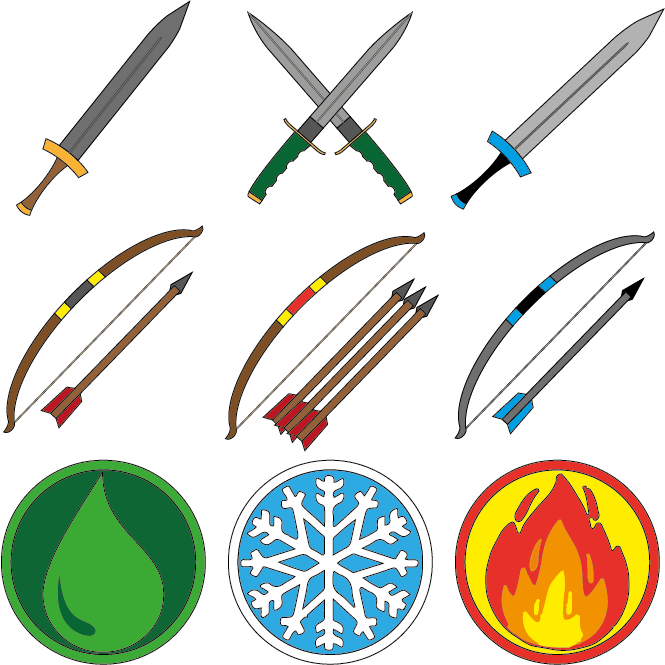
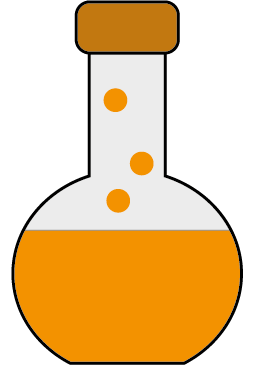
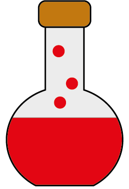
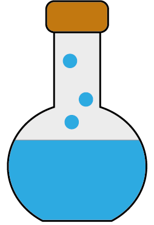
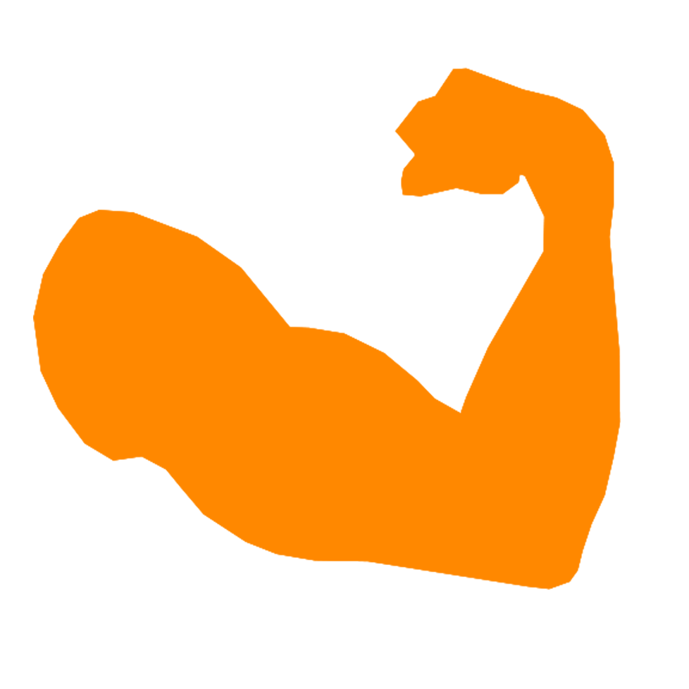
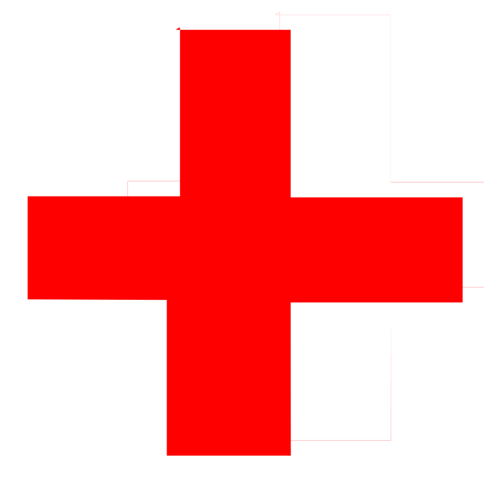

# Groupe Eau-Mineral
# Game Design
## Concept
Vous êtes un aventurier qui est tombé dans un trou, s'avèrent être un donjon dans lequel il vous faut trouver la sortie.

Vous devez passer de salle en salle en effectuant des quêtes qui changent à chaque salle.
Vous serez amené à combattre pour votre vie, votre équipement et votre dextérité seront les clés pour survivre.

Vous commencez la partie avec votre équipement de base, à savoir une épée toute simple qui va changer au cours de la partie.

La difficulté du jeu augmente au fur et à mesure que la partie se déroule.

## Gamplay
Notre RPG est un jeu 2D a avec une vue du dessus.
### Objectif de salle
Le joueur progresse dans un limbyrinthe peuplé de monstre.
Chaque salle de ce linbyrinth donne un objectif au joueur :
- Massacre : Le joueur doit tuée tout les monstre présent dans la salle avant de pouvoir continuer son chemin.
- Clef : Un des monstre present dans la piece a une clés sur  luis il faut lui dérobé pour pouvoir sortire.

### Armes
Le Systeme de combat est aussi ce qui rend notre jeux interessant :

Le joueur posséde en bas a droite de l'écrant 4 slot. ils constitue l'inventaire. Ce que le joueur peut utilisé :
- Slot d'arme : Permet de contenir une arme qui vas changer la manier d'attaquer du personnage. Chaque arme a des caracteristique differente afin de modifié le gameplay :

    - L'épee simple : Coup simple devant le personnage.
    - L'épee double : Inflige moin de dégat que l'épée simple mais  permet d'attaqué plus vite.
    - L'arc simple : Permet d'envoyer un projectile devant le personnage.

(Image des different arme et pouvoir)

Les potion sont des consomable qui prenne un slot dans l'inventaire le joueur ne peut en avoir qu'une seule.

Leur Effet sont un booste de force Un soint instatané et un boost de vitesse

## Generation Procedurale

## Vidéo GamePlay

(https://www.youtube.com/watch?v=N6DmQTyGbJUv)

